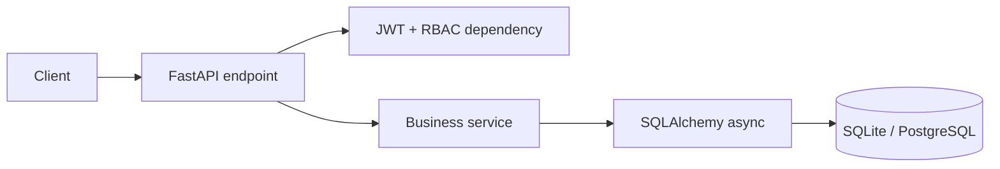

# StockFlow API

API RESTful de gestão de estoque e vendas para um SaaS multi-tenant simples. O
projeto demonstra FastAPI assíncrono, arquitetura em camadas, isolamento por
organização, RBAC, JWT, transações de estoque, migrações e testes de integração.

## Principais recursos

- Cadastro de organização com criação automática do usuário `owner`.
- Login OAuth2 Password Flow e access token JWT com expiração.
- Cinco funções: `owner`, `admin`, `manager`, `salesperson` e `viewer`.
- Isolamento de usuários, produtos, vendas e movimentações por `tenant_id`.
- Catálogo de produtos, busca, paginação e filtro de estoque baixo.
- Ajustes de estoque com trilha de movimentações.
- Venda atômica com snapshot de preço/produto e baixa de estoque.
- Cancelamento idempotente protegido, com reposição de estoque e auditoria.
- SQLite no desenvolvimento/teste e PostgreSQL no Docker/produção.
- OpenAPI/Swagger e ReDoc gerados automaticamente.
- Página inicial responsiva, em português, para apresentação do projeto.
- Painel administrativo completo para demonstrar autenticação, produtos, estoque,
  vendas e usuários diretamente no navegador.
- Comando idempotente para carregar uma organização e produtos demonstrativos.
- Tracing OpenTelemetry de requisições e transações, correlacionado por
  `request_id`, com métricas de negócio sem identificação do tenant.
- Stack local com Collector, Prometheus, Tempo, Grafana e dashboard versionado.

## Arquitetura

```text
app/
├── api/
│   ├── dependencies.py       # autenticação e autorização centralizadas
│   └── v1/
│       ├── endpoints/        # auth, users, products e sales
│       └── router.py
├── core/                     # settings, banco, segurança e exceções
├── models/                   # entidades e constraints SQLAlchemy
├── schemas/                  # contratos Pydantic V2
├── services/                 # casos de uso e regras de negócio
├── static/                   # painel administrativo responsivo
├── cli/                      # utilitários, incluindo carga demo
├── tests/                    # testes unitários e de integração
└── main.py                   # composição da aplicação
alembic/                      # migrações versionadas
observability/                # Collector, Prometheus, Tempo e Grafana
```

O endpoint recebe e valida o contrato, a dependência resolve identidade e
permissão, e o serviço executa a regra de negócio. Os serviços nunca confiam em
um `tenant_id` vindo do cliente: o escopo é obtido do usuário autenticado.



## Matriz de permissões

| Ação | Owner | Admin | Manager | Salesperson | Viewer |
|---|:---:|:---:|:---:|:---:|:---:|
| Consultar produtos e vendas | ✓ | ✓ | ✓ | ✓ | ✓ |
| Criar/editar produto e ajustar estoque | ✓ | ✓ | ✓ | — | — |
| Desativar produto | ✓ | ✓ | — | — | — |
| Criar venda | ✓ | ✓ | ✓ | ✓ | — |
| Cancelar venda | ✓ | ✓ | ✓ | — | — |
| Gerenciar usuários | ✓ | ✓* | — | — | — |

\* Um usuário só pode atribuir funções abaixo da sua própria hierarquia; o
`owner` não pode ser alterado ou criado pela API de usuários.

## Execução local com SQLite

Requer Python 3.11 ou superior.

```bash
python -m venv .venv
source .venv/bin/activate  # Windows: .venv\Scripts\activate
pip install -r requirements-dev.txt
cp .env.example .env       # Windows: copy .env.example .env
alembic upgrade head
uvicorn app.main:app --reload
```

Acesse:

- Apresentação: <http://localhost:8000/>
- Painel administrativo: <http://localhost:8000/painel>
- Swagger UI: <http://localhost:8000/docs>
- ReDoc: <http://localhost:8000/redoc>
- Health check: <http://localhost:8000/health>

## Execução com Docker e PostgreSQL

Defina segredos distintos para a API e o PostgreSQL antes de subir os serviços:

```bash
export SECRET_KEY="$(openssl rand -hex 32)"
export POSTGRES_PASSWORD="$(openssl rand -hex 24)"
export GRAFANA_ADMIN_PASSWORD="$(openssl rand -hex 24)"
docker compose up --build
```

No PowerShell:

```powershell
$env:SECRET_KEY = '<segredo-aleatorio-com-32-ou-mais-caracteres>'
$env:POSTGRES_PASSWORD = '<senha-exclusiva-do-banco>'
$env:GRAFANA_ADMIN_PASSWORD = '<senha-exclusiva-do-grafana>'
docker compose up --build
```

O container da API aplica `alembic upgrade head` antes de iniciar.
No Compose, a documentação interativa permanece desativada por padrão; defina
`ENABLE_DOCS=true` apenas no ambiente local se quiser expor Swagger e ReDoc.

A stack também disponibiliza, somente no host local:

- Grafana e dashboard StockFlow: <http://localhost:3001>
- Prometheus: <http://localhost:9090>
- Tempo: <http://localhost:3200>
- Receiver OTLP/HTTP do Collector: <http://localhost:4318>

Para produção, configure também `ENVIRONMENT=production`, `ALLOWED_HOSTS` com
o domínio público e `CORS_ORIGINS` somente com origens HTTPS autorizadas. Swagger,
ReDoc e OpenAPI ficam desativados por padrão nesse ambiente. Publique a API atrás
de um reverse proxy com TLS e rate limiting distribuído; o limitador interno é uma
segunda camada por processo.

## Observabilidade de vendas

O fluxo `POST /api/v1/sales` produz um trace com os spans de servidor HTTP,
autenticação JWT, consulta do usuário, decisão RBAC, transação, consulta de
produtos, bloqueio pessimista, persistência, commit ou rollback e consulta do
resultado. O header `X-Request-ID` devolvido pela API também é gravado em cada
span como `request.id`, permitindo encontrar a execução no Tempo sem transformar
esse identificador em label de métrica.

Métricas exportadas pelo aplicativo:

- `stockflow.sales.completed`: commits de vendas confirmados;
- `stockflow.sales.rollbacks`: transações de venda revertidas;
- `stockflow.sales.insufficient_stock`: rejeições por falta de estoque;
- `stockflow.sales.transaction.duration`: histograma de duração da transação.

As métricas não recebem e-mail, nome, usuário, produto, `tenant_id` nem
`request_id`. O Collector remove esses atributos defensivamente caso sejam
adicionados por engano no futuro. Consulte [docs/OBSERVABILITY.md](docs/OBSERVABILITY.md)
para operação, consultas PromQL/TraceQL e decisões de privacidade.

## Fluxo rápido da API

Cadastre a primeira organização:

```bash
curl -X POST http://localhost:8000/api/v1/auth/register \
  -H "Content-Type: application/json" \
  -d '{
    "organization_name": "Acme",
    "full_name": "Ana Admin",
    "email": "ana@acme.test",
    "password": "uma-senha-segura"
  }'
```

Use o `access_token` retornado como `Authorization: Bearer <token>`. O login
posterior usa `application/x-www-form-urlencoded`, com o e-mail no campo
`username`, conforme o fluxo OAuth2 usado pelo Swagger.

### Dados de demonstração

Em um ambiente local, carregue uma organização e três produtos de exemplo:

```bash
python -m app.cli.seed_demo
```

Credenciais padrão da carga local:

- E-mail: `demo@stockflow.dev`
- Senha: `Demo@StockFlow123`

O comando é idempotente e recusa execução quando `ENVIRONMENT=production`.
E-mail e senha podem ser alterados com `--email` e `--password`.

## Controles de segurança

- `SECRET_KEY` obrigatória e validação fail-fast de configurações de produção;
- JWT HS256 com issuer, audience, tipo, emissão e expiração obrigatórios;
- bcrypt, senha mínima de 12 caracteres e proteção contra enumeração por timing;
- rate limit nos endpoints de autenticação e limite global de payload;
- CORS explícito, hosts confiáveis, CSP, HSTS em produção e demais headers;
- contêiner Alpine não-root, somente leitura, sem capabilities e sem privilégios;
- Bandit, `pip-audit`, CodeQL, Dependabot e ações fixadas por commit no CI;
- isolamento por `tenant_id` e autorização RBAC validada no banco a cada requisição.
- telemetria sem PII/tenant nas métricas e correlação de traces por ID opaco.

Endpoints principais:

- `POST /api/v1/auth/register` e `POST /api/v1/auth/token`
- `GET /api/v1/auth/me`
- `GET /api/v1/dashboard/summary`
- `POST|GET|PATCH /api/v1/users`
- `POST|GET|PATCH|DELETE /api/v1/products`
- `POST /api/v1/products/{id}/stock-adjustments`
- `GET /api/v1/products/{id}/stock-movements`
- `POST|GET /api/v1/sales`
- `POST /api/v1/sales/{id}/cancel`

## Decisões de segurança e consistência

- Senhas nunca são armazenadas em texto puro; `bcrypt` aplica salt e custo.
- O token contém identidade e contexto, mas o usuário e seu estado ativo são
  novamente validados no banco em cada requisição.
- E-mails são globalmente únicos para permitir login não ambíguo sem pedir o
  tenant no OAuth2 Password Flow.
- Operações de estoque usam transação e `SELECT ... FOR UPDATE` (efetivo no
  PostgreSQL) para impedir venda concorrente acima do saldo.
- Valores monetários usam `Decimal`/`NUMERIC`, nunca ponto flutuante.
- Exclusão de produto é lógica, preservando o histórico de vendas.
- Itens de venda guardam nome, SKU e preço como snapshot histórico.

Para produção, mantenha `SECRET_KEY` em um secret manager, restrinja CORS,
execute atrás de TLS/reverse proxy e aplique rate limiting no gateway.

## Testes e qualidade

```bash
pytest
ruff check .
ruff format --check .
mypy app
alembic check
```

Os testes usam SQLite em memória, substituem a dependência de sessão da API e
cobrem autenticação, RBAC, isolamento de tenant e o ciclo venda/cancelamento.
O workflow em `.github/workflows/ci.yml` executa lint e testes a cada push ou PR.
Ele também valida tipagem, consistência das migrações e o build da imagem Docker.

Atalhos equivalentes estão disponíveis no `Makefile`, por exemplo `make quality`,
`make seed` e `make docker-up`.

Consulte `CONTRIBUTING.md` para o fluxo de colaboração e `SECURITY.md` para as
premissas de implantação e comunicação responsável de vulnerabilidades.
Uma descrição mais profunda das decisões técnicas está em `docs/ARCHITECTURE.md`.

## Migrações futuras

Após alterar modelos:

```bash
alembic revision --autogenerate -m "describe change"
alembic upgrade head
```

Revise sempre a migração gerada antes de aplicá-la em produção.
