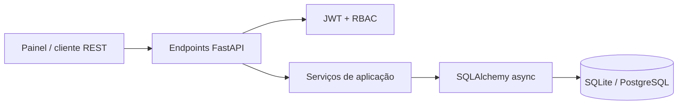
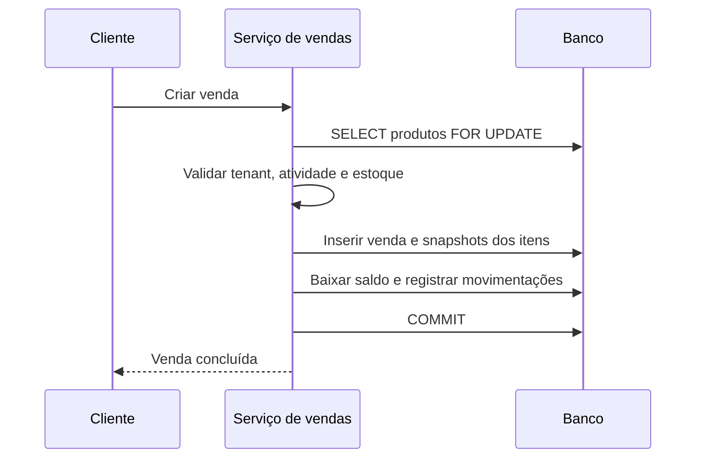

# Arquitetura do StockFlow

## Visão geral

O StockFlow organiza o Backend em camadas com dependências apontando para o
domínio da aplicação. Endpoints tratam HTTP, serviços concentram casos de uso e
modelos representam persistência. Schemas Pydantic são os contratos públicos.

## Isolamento multi-tenant

O tenant nunca é aceito do corpo ou query string para operações de domínio. A
dependência de autenticação obtém o usuário no banco e os serviços recebem o
`tenant_id` dessa identidade. Produtos, usuários, vendas e movimentações são
filtrados por esse valor.

Essa escolha evita IDOR entre organizações mesmo quando alguém conhece um UUID
válido de outro tenant. Os testes de integração exercitam explicitamente esse
cenário.

## Autenticação e autorização

1. O usuário envia e-mail e senha ao OAuth2 Password Flow.
2. A senha é comparada com o hash bcrypt.
3. O access token JWT recebe `sub`, `tenant_id`, `role`, `iss`, `aud` e expiração.
4. Em cada requisição o usuário é consultado novamente no banco.
5. Dependências RBAC verificam a função atual persistida, não apenas a claim.

A consulta por requisição permite que desativação e mudança de função tenham
efeito imediato, sem aguardar a expiração do token.

## Consistência de estoque e vendas

No PostgreSQL, o bloqueio pessimista serializa vendas concorrentes do mesmo
produto. Qualquer item sem saldo provoca rollback da operação inteira. O
cancelamento bloqueia venda e produtos, devolve todos os itens e grava novas
movimentações.

Itens guardam nome, SKU e preço como snapshot; alterações futuras no catálogo
não reescrevem o histórico financeiro.

## Decisões de modelagem

- UUIDs evitam IDs sequenciais previsíveis na API.
- `Decimal`/`NUMERIC` preserva valores monetários.
- Constraints no banco complementam validação Pydantic.
- Produto é desativado logicamente para preservar referências históricas.
- E-mail é globalmente único para login OAuth2 não ambíguo.
- Movimentações registram saldo resultante, ator, motivo e referência da venda.

## Painel administrativo

O painel é uma SPA leve, sem dependências de build, servida pelo próprio
FastAPI. Ele usa `sessionStorage` para manter o token apenas durante a sessão da
aba e respeita a matriz RBAC ao apresentar ações. A API continua sendo a fonte
de verdade e rejeita qualquer operação não autorizada, independentemente da UI.

## Evolução recomendada

Em uma implantação comercial, os próximos passos naturais seriam refresh token
com rotação/revogação, auditoria de alterações de usuários, rate limiting no
gateway, observabilidade OpenTelemetry e filas para relatórios ou integrações.
