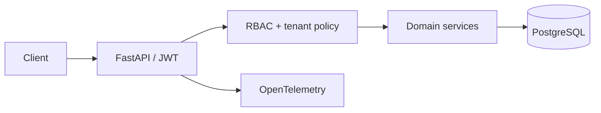

# Portfolio overview

## Architecture

## Core flow

1. An authenticated user selects a tenant-scoped workspace.
2. The API verifies role permissions before processing inventory or sales data.
3. The transaction is persisted and emitted to observability tooling.

## Environment and data

Copy the project environment example, provide a local PostgreSQL database, then run migrations and tests. The public demo uses only fixture data; no commercial inventory or customer record is included.

## Decisions

- PostgreSQL is used for transactional consistency instead of an in-memory production store.
- Tenant scoping is enforced in the application service layer and covered by tests.
- Telemetry is optional locally, keeping the development loop lightweight.
